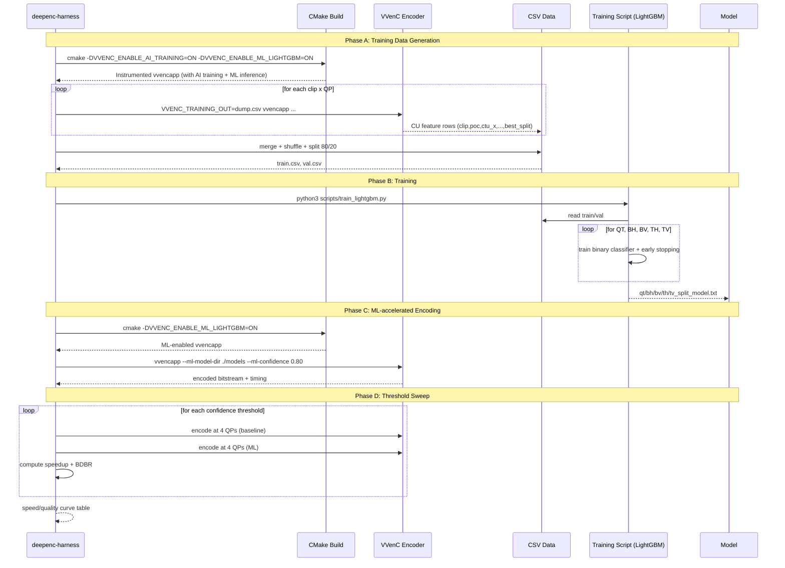
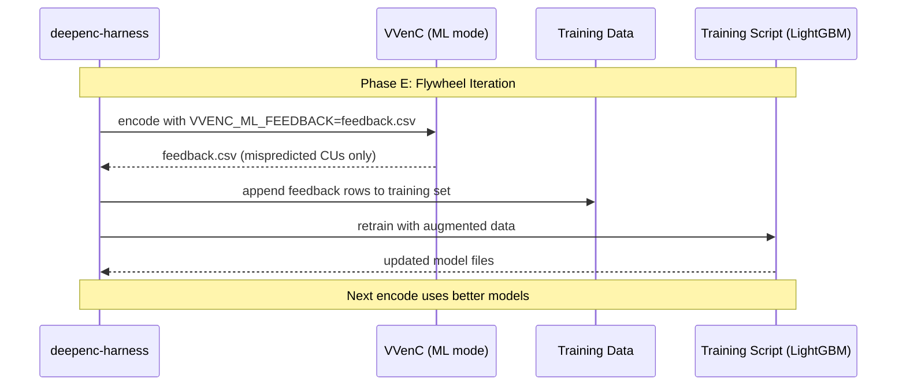
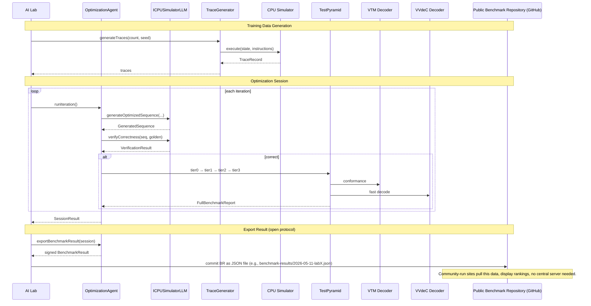
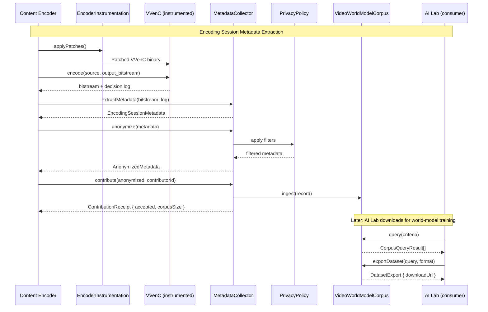

# Technical Specification: VVenC AI‑Driven Optimization Ecosystem with Emergent Competitive Marketplace

## 1. Overview

This specification defines the open‑source tooling that transforms the VVenC H.266/VVC encoder into the fastest software encoder through a **self‑organizing emergent marketplace**. The system provides:

1. **A deterministic trace‑generation harness** that produces CPU‑state training data for AI‑based code optimizers.
2. **A multi‑tier test pyramid** that validates kernel correctness and performance, using the VTM reference decoder as the oracle.
3. **An optimization agent** that orchestrates LLM‑driven superoptimization loops against VVenC hot functions.
4. **An instrumented encoder** that emits anonymized, structural‑only metadata during normal encoding, feeding a global, open **video world‑model corpus**.

Critically, the marketplace itself is **not a piece of software we build**. It emerges from the convergence of these tools, the open benchmark data they produce, and the economic incentives of AI labs, content distributors, hardware vendors, and archivists. No central platform, registry, or leaderboard service is required; the market self‑organises around a trustless, reproducible benchmark format.

### 4.3 ML Training and Encoding Flow



### 4.4 Feedback Flywheel



### 1.1 Key Design Principles

- **Open Traces, Open Weights**: All training traces and benchmark results are public.
- **Correctness as Invariant**: Every optimization must pass deterministic VTM conformance.
- **Marketplace Emergence**: The competitive layer is not coded – it is an emergent property of the open data and the economic forces it attracts.
- **Privacy‑Preserving Telemetry**: Encoding metadata contains zero pixels; only structural decisions.
- **Portability**: All core components are specifiable in TypeScript, trivial to port to C or Rust.

---

## 2. Component Specifications

### 2.1 `TraceGenerator`

Generates labelled microarchitectural execution traces for VVenC hot functions.

```typescript
class TraceGenerator {
  constructor(
    readonly hotFunctionPath: string,
    readonly simulator: SimulatorBackend,
    readonly outputFormat: "jsonl" | "binary",
    readonly architecture: string
  );

  public generateTraces(count: number, seed: number): AsyncIterator<TraceRecord>;
  public validateTrace(trace: TraceRecord): ValidationReport;
}

interface SimulatorBackend {
  readonly name: string;
  execute(inputState: CpuState, instructions: Instruction[]): Promise<TraceRecord>;
  getAvailablePerformanceCounters(): string[];
}

interface InstructionTrace {
  instructionIndex: number;
  instructionBytes: Uint8Array;
  instructionMnemonic: string;
  stateBefore: CpuState;
  stateAfter: CpuState;
  cyclesElapsed: number;
  stallReason: StallReason | null;
  microArchEvents: MicroArchEvent[];
}

interface TraceRecord {
  traceId: string;
  architecture: string;
  functionName: string;
  inputState: CpuState;
  instructions: InstructionTrace[];
  totalCycles: number;
  finalState: CpuState;
  checksum: string;
}

interface CpuState {
  gpr: Map<string, bigint>;
  simd: Map<string, bigint[]>;
  flags: CpuFlags;
  rip: bigint;
  rsp: bigint;
  memory: Map<bigint, Uint8Array>;
}

interface CpuFlags {
  cf: boolean; zf: boolean; sf: boolean; of: boolean; pf: boolean; af: boolean;
}

type StallReason =
  | "data_dependency"
  | "load_miss_L1"
  | "load_miss_L2"
  | "load_miss_L3"
  | "store_forwarding"
  | "branch_mispredict"
  | "port_conflict"
  | "instruction_cache_miss"
  | null;

interface MicroArchEvent {
  eventType: "cache_miss" | "branch_mispredict" | "tlb_miss" | "port_conflict" | "other";
  count: number;
}

interface ValidationReport {
  valid: boolean;
  anomalies: string[];
  warnings: string[];
}
```

### 2.2 `TestPyramid`

Four‑tier validation pipeline.

```typescript
class TestPyramid {
  constructor(
    readonly vvencSourcePath: string,
    readonly vtmPath: string,
    readonly vvdecPath: string,
    readonly testClipsDir: string,
    readonly buildCacheEnabled: boolean
  );

  public async tier0_buildAndSmoke(patchPath: string): Promise<BuildResult>;
  public async tier1_unitCorrectness(functionName: string, kernelPath: string): Promise<UnitTestReport>;
  public async tier2_encodeDecodeRoundTrip(clipSet: ClipSet, encoderBinaryPath: string): Promise<RoundTripReport>;
  public async tier3_fullConformanceAndBenchmark(candidateBranch: string): Promise<FullBenchmarkReport>;
}

type ClipSet = "motion_estimation" | "transform" | "intra_prediction" | "deblocking" | "full";

interface BuildResult {
  success: boolean;
  compilerOutput: string;
  buildTimeMs: number;
  objectPath: string | null;
}

interface UnitTestReport {
  passed: boolean;
  totalCases: number;
  passedCases: number;
  failingCases: InputOutputPair[];
  averageCycles: number;
}

interface InputOutputPair {
  input: CpuState;
  expectedOutput: CpuState;
  actualOutput: CpuState;
  divergencePoint: string;
}

interface RoundTripReport {
  passed: boolean;
  clipsTested: string[];
  perClipResults: Map<string, ClipRoundTripResult>;
  overallTimeSeconds: number;
}

interface ClipRoundTripResult {
  clipName: string;
  encodeSuccess: boolean;
  decodeSuccess: boolean;
  bitExactMatch: boolean;
  firstMismatchFrame: number | null;
  firstMismatchDescription: string | null;
}

interface FullBenchmarkReport {
  conformant: boolean;
  conformantBitstreamsTotal: number;
  conformantBitstreamsPassed: number;
  bdRate: number;
  psnrDelta: number;
  vmafDelta: number;
  encodingFps: number;
  profileFlamegraph: string;
}
```

### 2.3 `CPUSimulatorLLM`

Interface for an LLM‑based CPU state simulator and superoptimizer.

```typescript
interface ICPUSimulatorLLM {
  readonly modelId: string;
  readonly modelVersion: string;
  readonly supportedArchitectures: string[];

  predictExecution(
    instructions: Instruction[],
    initialState: CpuState,
  ): Promise<PredictedTrace>;
  generateOptimizedSequence(
    specification: string,
    targetArchitecture: string,
    initialStateTemplate: CpuState,
    optimizationBudget: number,
  ): Promise<GeneratedSequence>;
  verifyCorrectness(
    sequence: Instruction[],
    goldenFinalState: CpuState,
  ): Promise<VerificationResult>;
}

interface PredictedTrace {
  instructions: PredictedInstructionState[];
  totalCycles: number;
  finalState: CpuState;
  confidence: number;
}

interface PredictedInstructionState {
  instructionIndex: number;
  stateAfter: CpuState;
  cyclesElapsed: number;
  stallReason: StallReason;
}

interface GeneratedSequence {
  instructions: Instruction[];
  predictedTotalCycles: number;
  predictedFinalState: CpuState;
  confidence: number;
  generationTokens: number;
}

interface VerificationResult {
  correct: boolean;
  firstMismatchIndex: number | null;
  expectedState: CpuState | null;
  predictedState: CpuState | null;
  divergenceDescription: string | null;
}

interface Instruction {
  mnemonic: string;
  operands: string[];
  encoding: Uint8Array;
  address: bigint;
}
```

### 2.4 `OptimizationAgent`

Orchestrates the LLM optimisation loop. The agent is completely self‑contained; it does not know about any marketplace – it only produces a **signed `BenchmarkResult`** that external communities can consume.

```typescript
class OptimizationAgent {
  constructor(
    readonly llm: ICPUSimulatorLLM,
    readonly testPyramid: TestPyramid,
    readonly targetFunction: string,
    readonly targetArchitecture: string,
    readonly maxIterations: number,
    readonly signingKey?: CryptoKey   // optional Ed25519 key for signing results
  );

  public async runIteration(): Promise<IterationResult>;
  public async runSession(): Promise<SessionResult>;

  /**
   * After a successful session, produce a cryptographically signed
   * BenchmarkResult that can be shared with any independent ledger.
   * @returns Signed benchmark result with all tiers’ data.
   */
  public exportBenchmarkResult(session: SessionResult): Promise<BenchmarkResult>;
}

interface IterationResult {
  iterationNumber: number;
  candidateCorrect: boolean;
  predictedCycles: number;
  tier0Passed: boolean;
  tier1Passed: boolean;
  tier2Passed: boolean;
  tier2ActualCycles: number | null;
  wallClockTimeMs: number;
}

interface SessionResult {
  bestCandidateId: string;
  bestPredictedCycles: number;
  bestVerifiedCycles: number | null;
  totalIterations: number;
  successfulIterations: number;
  improvementOverBaseline: number;
}

/** Standardised, self‑verifiable benchmark output for the emergent market */
interface BenchmarkResult {
  submissionId: string;        // UUID
  labId: string;
  modelId: string;
  functionName: string;
  targetArchitecture: string;
  kernelHash: string;          // SHA‑256 of the submitted kernel source
  verifiedCycles: number;      // from Tier 3 benchmark
  bdRate: number;
  conformancePassed: boolean;
  timestamp: string;           // ISO 8601
  // Ed25519 signature over the JSON object (excluding signature field)
  signature: string;
}
```

### 2.5 `DistributedMetadataCollector`

Collects anonymized structural metadata from encoding sessions.

```typescript
class DistributedMetadataCollector {
  constructor(
    readonly corpusEndpoint: string,
    readonly privacyPolicy: PrivacyPolicy,
    readonly contributionLimits: ContributionLimits
  );

  public extractMetadata(encodedBitstream: string, encoderLog: string): Promise<EncodingSessionMetadata>;
  public anonymize(rawMetadata: EncodingSessionMetadata): Promise<AnonymizedMetadata>;
  public contribute(metadata: AnonymizedMetadata, contributorId: string): Promise<ContributionReceipt>;
  public queryCorpus(query: CorpusQuery): AsyncIterator<AnonymizedMetadata>;
}

interface EncodingSessionMetadata {
  encoderVersion: string;
  preset: string;
  resolution: { width: number; height: number };
  frameCount: number;
  perFrameDecisions: FrameDecision[];
  aggregateStats: AggregateStats;
}

interface FrameDecision {
  frameIndex: number;
  codingUnits: CUDecision[];
}

interface CUDecision {
  cuAddress: { x: number; y: number };
  size: { width: number; height: number };
  splitType: string;
  predMode: "intra" | "inter" | "skip";
  motionVectors: MotionVector[];
  referenceFrames: number[];
  residualEnergy: number;
  qp: number;
}

interface MotionVector {
  refIdx: number;
  dx: number;
  dy: number;
}

interface AggregateStats {
  averageQP: number;
  intraRatio: number;
  skipRatio: number;
  averageMotionMagnitude: number;
  averageResidualEnergy: number;
  bitrate: number;
}

interface AnonymizedMetadata {
  recordId: string;
  encoderVersion: string;
  resolution: { width: number; height: number };
  frameCount: number;
  perFrameDecisions: FrameDecision[];
  aggregateStats: AggregateStats;
  contributorHash: string;
  timestamp: string;   // week granularity
}

interface PrivacyPolicy {
  stripFrameTimestamps: boolean;
  hashContributorId: boolean;
  maxResolutionReporting: "full" | "binned";
  timeGranularity: "week" | "month" | "year";
  minimumFrameCount: number;
}

interface ContributionLimits {
  maxRecordsPerDay: number;
  maxRecordsPerWeek: number;
  maxTotalStorageBytes: number;
}

interface ContributionReceipt {
  recordId: string;
  accepted: boolean;
  rejectionReason: string | null;
  corpusSize: number;
}

interface CorpusQuery {
  resolution?: { minWidth?: number; maxWidth?: number };
  minFrameCount?: number;
  maxFrameCount?: number;
  intraRatioRange?: { min: number; max: number };
  averageMotionRange?: { min: number; max: number };
  encoderVersion?: string;
  dateRange?: { start: string; end: string };
  limit?: number;
}
```

### 2.6 `VideoWorldModelCorpus`

Aggregated open corpus for video world‑model training.

```typescript
class VideoWorldModelCorpus {
  constructor(
    readonly storageBackend: CorpusStorage,
    readonly indexBackend: CorpusIndex,
    readonly accessPolicy: AccessPolicy
  );

  public ingest(record: AnonymizedMetadata): Promise<void>;
  public query(query: CorpusQuery): Promise<CorpusQueryResult[]>;
  public exportDataset(query: CorpusQuery, format: "jsonl" | "tfrecord" | "webdataset"): Promise<DatasetExport>;
  public getStats(): Promise<CorpusStats>;
}

interface CorpusQueryResult {
  recordId: string;
  contributorHash: string;
  resolution: { width: number; height: number };
  frameCount: number;
  aggregateStats: AggregateStats;
  sharedDate: string;
}

interface DatasetExport {
  downloadUrl: string;
  format: string;
  recordCount: number;
  totalSizeBytes: number;
  expiresAt: string;
}

interface CorpusStats {
  totalRecords: number;
  totalFrames: number;
  uniqueContributors: number;
  resolutionDistribution: Map<string, number>;
  totalSizeBytes: number;
  lastUpdated: string;
}

interface CorpusStorage {
  store(recordId: string, data: AnonymizedMetadata): Promise<void>;
  retrieve(recordId: string): Promise<AnonymizedMetadata>;
  retrieveBatch(recordIds: string[]): AsyncIterator<AnonymizedMetadata>;
}

interface CorpusIndex {
  index(record: AnonymizedMetadata): Promise<void>;
  search(query: CorpusQuery): Promise<CorpusQueryResult[]>;
}

interface AccessPolicy {
  allowAnonymousQueries: boolean;
  allowAnonymousDownloads: boolean;
  maxDownloadRecordsPerQuery: number;
  requireAttribution: boolean;
}
```

### 2.7 `EncoderInstrumentation`

Patches VVenC to emit side‑channel decision logs.

```typescript
class EncoderInstrumentation {
  constructor(
    readonly vvencSourcePath: string,
    readonly patchDirectory: string
  );

  public applyPatches(): Promise<PatchReport>;
  public verifyBitstreamIntegrity(): Promise<boolean>;
  public revertPatches(): Promise<void>;
}

interface PatchReport {
  applied: boolean;
  patchedFiles: string[];
  rejectedFiles: string[];
  errors: string[];
}
```

### 2.8 `MlWorkflow`

Manages the LightGBM CU split prediction lifecycle: training data generation, model training, ML-accelerated encoding, benchmarking, confidence threshold tuning, and feedback-driven iteration. Implemented as standalone module-level functions (not a class).

```typescript
// Clip specification
interface ClipSpec {
  path: string;
  name: string;
  width: number;
  height: number;
  fps: number;
}

// Data generation (Phase A)
interface DataGenerateOpts {
  clips: ClipSpec[];
  qps: number[];
  dataDir: string;
  vvencappPath?: string;
  root?: string;
}
interface DataGenerateReport {
  clipResults: Record<string, { csvPath: string; rows: number }>;
  totalRows: number;
}
// Sets VVENC_TRAINING_OUT env var per clip×QP combination

// Data split (Phase A)
interface DataSplitOpts {
  dataDir: string;
  trainRatio: number;
}
interface DataSplitReport {
  trainPath: string;
  valPath: string;
  trainRows: number;
  valRows: number;
}

// Training (Phase B)
interface TrainOpts {
  trainPath: string;
  valPath: string;
  outputDir: string;
  scriptPath?: string;
}
interface TrainReport {
  models: string[];
  perSplitAuc: Record<string, number>;
}
// Shells out to scripts/train_lightgbm.py (--train --val --output-dir)

// ML encode (Phase C)
interface EncodeOpts {
  clip: ClipSpec;
  qp: number;
  modelDir: string;
  confidence: number;
  vvencappPath?: string;
  root?: string;
}
interface EncodeReport {
  encodingTimeMs: number;
  mlSkipRate: number;
  avgConfidence: number;
  bitrate: number;
  psnr: number;
}

// Baseline vs ML benchmark (Phase C)
interface BenchOpts {
  clip: ClipSpec;
  qps: number[];
  modelDir: string;
  confidence: number;
  vvencappPath?: string;
  root?: string;
}
interface BenchReport {
  baseline: EncodeReport;
  ml: EncodeReport;
  speedupPercent: number;
  bdRate: number;
}
// BDBR computed in TypeScript via cubic interpolation (VCEG-M34)

// Sweep confidence thresholds (Phase D)
interface SweepOpts {
  clip: ClipSpec;
  qps: number[];
  modelDir: string;
  thresholds: number[];
  vvencappPath?: string;
  root?: string;
}
interface SweepReport {
  results: Record<number, BenchReport>;
}

// Feedback flywheel (Phase E)
interface FeedbackOpts {
  clip: ClipSpec;
  qp: number;
  modelDir: string;
  confidence: number;
  dataDir: string;
  vvencappPath?: string;
  scriptPath?: string;
  root?: string;
}
interface FeedbackReport {
  mispredictions: number;
  augmentedRows: number;
  trainReport: TrainReport;
}
// Sets VVENC_ML_FEEDBACK env var during encode, collects mispredicted CU rows
```

---

## 3. System Architecture

The following C4 Container diagram shows the static relationships.  
**There is no marketplace container.** The emergent market layer is depicted as an **external, dashed‑boundary set of community‑run services** that consume the open `BenchmarkResult` protocol.

```mermaid
graph TB
    subgraph External["External Actors"]
        AILab["AI Lab<br/>(Optimizer LLM)"]
        SceneGroup["Scene Group"]
        Archivist["Archivist"]
        StreamingService["Streaming Service"]
        HardwareVendor["Hardware Vendor"]
    end

    subgraph VVenCHarness["VVenC Harness (Delivered)"]
        direction TB
        subgraph Core["Core Optimization Engine"]
            TraceGen["TraceGenerator"]
            TestPyr["TestPyramid"]
            OptAgent["OptimizationAgent"]
        end
    subgraph DataFlywheel["Data Flywheel"]
        InstrEncoder["EncoderInstrumentation"]
        MetadataCollector["DistributedMetadataCollector"]
        WorldModelCorpus["VideoWorldModelCorpus"]
    end

    subgraph MlWorkflow["ML Workflow (LightGBM)"]
        MlDataGen["data generate<br/>instrumented encode"]
        MlDataSplit["data split<br/>train/val split"]
        MlTrain["train<br/>5x binary classifiers"]
        MlEncode["encode<br/>ML-guided CU split"]
        MlBench["bench<br/>speedup + BDBR"]
        MlSweep["sweep<br/>threshold tuning"]
        MlFeedback["feedback<br/>flywheel iteration"]
    end
    end

    subgraph EmergentMarketLayer["Emergent Market Layer (NOT delivered)"]
        direction TB
        CommunityRepo["Public Benchmark Repositories<br/>(e.g., GitHub, IPFS)"]
        IndependentBoard["Independent Leaderboards<br/>(community-run web sites)"]
        Aggregator["Community Metrics Aggregator"]
    end

    subgraph ExternalSystems["External Systems"]
        VTM["VTM Decoder"]
        VVdeC["VVdeC Decoder"]
        Simulator["CPU Simulator"]
        CorpusRepo["Open Corpus Repository"]
    end

    %% AI Lab
    AILab -->|downloads traces| TraceGen
    AILab -->|uses| OptAgent

    %% Optimization Loop
    OptAgent -->|generates traces| TraceGen
    OptAgent -->|validates| TestPyr
    TraceGen -->|executes| Simulator

    TestPyr -->|conformance| VTM
    TestPyr -->|fast decode| VVdeC

    %% Benchmark Result Publication (open protocol)
    OptAgent -->|publishes signed BenchmarkResult| CommunityRepo
    CommunityRepo -->|feeds| IndependentBoard
    CommunityRepo -->|aggregates| Aggregator

    %% Content Encoders
    SceneGroup -->|uses| InstrEncoder
    Archivist -->|uses| InstrEncoder
    StreamingService -->|uses| InstrEncoder

    InstrEncoder -->|emits decision log| MetadataCollector
    MetadataCollector -->|contributes| CorpusRepo
    WorldModelCorpus -->|aggregates| CorpusRepo

    HardwareVendor -.->|monitors demand signal| IndependentBoard

    AILab -.->|downloads| WorldModelCorpus

    %% ML Workflow connections
    MlDataGen -->|CSV rows| MlDataSplit
    MlDataSplit -->|train/val| MlTrain
    MlTrain -->|5 model files| MlEncode
    MlEncode -->|compare| MlBench
    MlBench -->|drive| MlSweep
    MlEncode -.->|VVENC_ML_FEEDBACK| MlFeedback
    MlFeedback -.->|augment training set| MlTrain
```



### 3.1 Container Descriptions

| Container                        | Responsibility                                                                                                                                      |
| :------------------------------- | :-------------------------------------------------------------------------------------------------------------------------------------------------- |
| **TraceGenerator**               | Produces CPU‑state traces for LLM training.                                                                                                         |
| **TestPyramid**                  | Four‑tier validation pipeline, including VTM conformance.                                                                                           |
| **OptimizationAgent**            | Runs LLM‑driven superoptimization and exports signed `BenchmarkResult` files.                                                                       |
| **EncoderInstrumentation**       | Patches VVenC to emit structural encoding logs.                                                                                                     |
| **DistributedMetadataCollector** | Anonymises and contributes metadata to the corpus.                                                                                                  |
| **VideoWorldModelCorpus**        | Amasses and serves the open training corpus for video world models.                                                                                 |
| **MlWorkflow**                   | Manages LightGBM CU split prediction lifecycle: instrumented encode → CSV merge → model training → ML encode → benchmark → sweep → feedback loop.  |
| **Emergent Market Layer**        | **Not part of the harness.** Third parties independently publish, verify, and rank `BenchmarkResult` objects using the standardised, signed format. |

---

## 4. Detailed Data Flow

### 4.1 Optimization Cycle & Public Benchmark Flow



### 4.2 Metadata Collection Flow



---

## 5. Emergent Marketplace Dynamics

The competitive marketplace is **not a code artifact**. It arises organically from the intersection of:

1. **Reproducible, Signed Benchmarks**  
   The `BenchmarkResult` is a JSON object signed with the lab’s Ed25519 key. Any third party can run `benchmark verify` to reproduce the result on their own hardware, ensuring trustlessness.

2. **Open Publication**  
   Labs publish their results to any public repository (e.g., a dedicated GitHub repo, IPFS, or a community website). The format is standardised, so aggregators can automatically parse and rank submissions.

3. **Economic Incentives**  
   Labs compete because the same models that produce winning kernels for VVenC generalise to binary optimisation in cloud, embedded, and security domains. Ranking high on an independent leaderboard is a powerful marketing signal for their AI capabilities.

4. **Demand Signal Feedback**  
   Hardware vendors monitor the growing volume of H.266‑encoded content (driven by fast, free encoders) to decide when to add VVC decode to SoCs. Independent leaderboards showing sustained performance gains accelerate that decision.

5. **Corpus Growth Loop**  
   As content is re‑encoded with the optimised encoder, more anonymised metadata feeds the video world‑model corpus, which in turn attracts more AI labs, who then further optimise the encoder, and so on.

**No central server, operator, or registry is required.** The harness provides the immutable, verifiable data; the market self‑organises around it.

---

## 6. Testing Requirements

### 6.1 Unit Tests

| Class                            | Test Case                                    | Scenario                                        | Verification                                                             |
| :------------------------------- | :------------------------------------------- | :---------------------------------------------- | :----------------------------------------------------------------------- |
| **TraceGenerator**               | `test_generateTraces_deterministic`          | Same seed produces identical traces             | trace1.checksum == trace2.checksum                                       |
| **TraceGenerator**               | `test_generateTraces_varyingInputs`          | Different seeds produce different traces        | Unique trace IDs, varied input states                                    |
| **TraceGenerator**               | `test_validateTrace_valid`                   | Known-good trace passes validation              | ValidationReport.valid == true                                           |
| **TraceGenerator**               | `test_validateTrace_cycleMonotonicity`       | Trace with decreasing cycle count flagged       | ValidationReport has anomaly: "non-monotonic"                            |
| **TraceGenerator**               | `test_validateTrace_registerConsistency`     | Trace where state prediction deviates from spec | ValidationReport has anomaly                                             |
| **TestPyramid**                  | `test_tier0_buildSuccess`                    | Valid patch compiles                            | BuildResult.success == true                                              |
| **TestPyramid**                  | `test_tier0_buildFailure`                    | Invalid patch (syntax error)                    | BuildResult.success == false, output contains error                      |
| **TestPyramid**                  | `test_tier1_allPass`                         | Correct kernel matches golden for all inputs    | UnitTestReport.passed == true                                            |
| **TestPyramid**                  | `test_tier1_singleDivergence`                | Kernel with one wrong output                    | Report shows exact InputOutputPair with divergence                       |
| **TestPyramid**                  | `test_tier2_bitExactRoundTrip`               | Standard encode-decode                          | RoundTripReport.bitExactMatch == true                                    |
| **TestPyramid**                  | `test_tier2_corruptedBitstream`              | Bitstream intentionally corrupted               | RoundTripReport identifies mismatch frame                                |
| **TestPyramid**                  | `test_tier3_conformancePass`                 | Reference clip encodes conformantly             | FullBenchmarkReport.conformant == true                                   |
| **OptimizationAgent**            | `test_runIteration_correctCandidate`         | LLM returns correct, high-quality kernel        | IterationResult shows passed tiers                                       |
| **OptimizationAgent**            | `test_runIteration_incorrectCandidate`       | LLM returns incorrect kernel                    | IterationResult.candidateCorrect == false, no tier execution             |
| **OptimizationAgent**            | `test_sessionResult_bestTracked`             | Multiple iterations, best correctly identified  | SessionResult tracks best by predicted cycles                            |
| **OptimizationAgent**            | `test_exportBenchmarkResult_signature`       | Export result with signing key                  | BenchmarkResult signature verifies with the lab’s public key             |
| **OptimizationAgent**            | `test_exportBenchmarkResult_reproducibility` | Re-run tier3; export again                      | Two BenchmarkResults with same kernel hash and identical verified cycles |
| **DistributedMetadataCollector** | `test_extractMetadata_completeness`          | Known encoding session                          | Metadata contains all frames and CUs                                     |
| **DistributedMetadataCollector** | `test_anonymize_stripsTimestamps`            | Metadata with precise timestamps                | Output granularity matches PrivacyPolicy                                 |
| **DistributedMetadataCollector** | `test_anonymize_noPixelData`                 | Attempt to contribute pixel data                | Rejected—no pixel fields in AnonymizedMetadata                           |
| **DistributedMetadataCollector** | `test_contributionLimits_enforced`           | Exceed daily limit                              | ContributionReceipt.accepted == false                                    |
| **VideoWorldModelCorpus**        | `test_ingestAndQuery`                        | Ingest then query by resolution                 | Correct record returned                                                  |
| **VideoWorldModelCorpus**        | `test_exportDataset_jsonl`                   | Export matching query results                   | Valid JSONL with correct record count                                    |
| **EncoderInstrumentation**       | `test_applyPatches_modifiesSource`           | Apply patches                                   | Source files changed, patch report lists files                           |
| **EncoderInstrumentation**       | `test_verifyBitstreamIntegrity`              | Bitstream from patched vs. clean                | Bit-exact match returns true                                             |
| **MlWorkflow**                  | `test_dataGenerate_buildsEncoder`            | Generates instrumented encoder build            | Binary exists at expected path                                            |
| **MlWorkflow**                  | `test_dataGenerate_encodesClips`             | Encodes a clip, CSV produced                    | CSV exists with feature columns                                           |
| **MlWorkflow**                  | `test_dataSplit_ratio`                       | Split 100-row CSV 80/20                         | Train=80, val=20                                                          |
| **MlWorkflow**                  | `test_train_modelsCreated`                   | Train with valid CSV                            | 5 model files exist                                                       |
| **MlWorkflow**                  | `test_train_missingData`                     | No CSV                                          | Returns error, no crash                                                   |
| **MlWorkflow**                  | `test_encode_mlEnabled`                      | Encode with ML                                  | Non-zero ML skip rate                                                     |
| **MlWorkflow**                  | `test_bench_speedupPositive`                 | Compare baseline vs ML                          | Speedup > 0%                                                              |
| **MlWorkflow**                  | `test_sweep_monotonic`                       | 3 thresholds                                    | Higher threshold leads to higher BDBR                                     |

### 6.2 End-to-End Testing Strategy

**Environment Setup**:

- Mock CPU simulator (deterministic, fast) for TraceGenerator
- Mock VTM and VVdeC decoders (return pre-computed results)
- Temporary corpus storage (in-memory or local filesystem)
- Docker Compose stack with all containers for integration tests
- Pre-built test clips at resolutions 480p, 1080p, 2160p

**E2E Test Cases**:

| Test Case                          | Steps                                                                                                                                                                                                                        | Expected Outcome                                                                                                                      |
| :--------------------------------- | :--------------------------------------------------------------------------------------------------------------------------------------------------------------------------------------------------------------------------- | :------------------------------------------------------------------------------------------------------------------------------------ |
| **Full Optimization Pipeline**     | 1. Lab requests traces via TraceGen<br/>2. Lab's LLM generates candidate<br/>3. Agent runs full iteration<br/>4. Successful candidate exported as signed BenchmarkResult<br/>5. Result published to a mock public repository | Complete flow succeeds; signed result is published with valid cryptographic signature.                                                |
| **Concurrent Submissions**         | 1. Three labs run sessions simultaneously<br/>2. Each exports BenchmarkResult<br/>3. Results are all pushed to the same repository                                                                                           | All three results appear; no race conditions; independent verification shows kernel hashes are distinct and results are reproducible. |
| **Metadata Collection Privacy**    | 1. Three contributors encode different content<br/>2. Metadata collected, anonymized<br/>3. Attempt to reconstruct original video from metadata                                                                              | Metadata accepted; reconstruction impossible (verified by independent auditor).                                                       |
| **Contribution Limit Enforcement** | 1. Contributor exceeds daily limit<br/>2. Attempt submission beyond limit                                                                                                                                                    | Submission rejected with clear reason.                                                                                                |
| **Corpus Export for Training**     | 1. AI Lab queries corpus for "high motion, 4K"<br/>2. Receives 1000 matching records<br/>3. Exports as JSONL<br/>4. Downloads and validates                                                                                  | Export complete; all records match query; format valid.                                                                               |
| **Benchmark Reproducibility**      | 1. Extract BenchmarkResult from public repository<br/>2. Run `benchmark verify` on the same hardware (or equivalent)<br/>3. Compare verified cycles                                                                          | Verified cycles fall within statistical tolerance (±1%).                                                                              |
| **Failure Recovery**               | 1. Tier 2 round-trip fails for a submitted kernel<br/>2. Agent receives failure report with mismatch details<br/>3. Agent uses LLM to debug<br/>4. Revised kernel passes                                                     | Debug loop converges; revised kernel accepted and new BenchmarkResult exported.                                                       |

**Post-Test Validation**:

- All BenchmarkResult files have valid signatures.
- All corpus records are fully anonymized (no pixel data, no precise timestamps).
- All agent iterations produce audit logs that can be replayed.
- Benchmarks are reproducible within statistical tolerance.
- No cross-contamination between labs (each lab’s results are isolated by kernel hash).

---

## 7. CLI Entry Point

```
deepenc-harness <command> [options]

Commands:
  trace generate       Generate CPU state traces for a hot function
  trace validate       Validate an existing trace for internal consistency
  pyramid test         Run a specified tier against a candidate kernel
  pyramid full         Run all tiers against a candidate kernel
  agent run            Execute one optimization iteration
  agent session        Run a full optimization session
  benchmark export     Export a signed BenchmarkResult from a session
  benchmark verify     Reproduce a benchmark result from a published file
  metadata extract     Extract metadata from an encoding session
  metadata anonymize   Anonymize extracted metadata
  metadata contribute  Contribute anonymized metadata to the corpus
  corpus query         Query the video world-model corpus
  corpus export        Export a training dataset from the corpus
  instrument apply     Apply instrumentation patches to VVenC source
  instrument verify    Verify instrumented encoder bitstream integrity
  instrument revert    Remove instrumentation patches

  ml data-generate     Encode test clips with instrumented VVenC, collect feature CSV via VVENC_TRAINING_OUT
  ml data-split        Merge, shuffle, and split CSVs into train/val sets
  ml train             Train 5 binary LightGBM classifiers from training data
  ml encode            Encode a clip with ML-guided CU partitioning
  ml bench             Benchmark ML encoder vs baseline (speedup + BDBR)
  ml sweep             Sweep confidence thresholds, produce speed/quality curve
  ml feedback          Collect mispredictions, augment dataset, retrain model

Global Options:
  --config <path>      Path to configuration file
  --verbose            Enable verbose logging
  --output <format>    Output format (text, json, csv)

ML Subcommand Options:
  --clips <path>        Single YUV clip path (requires --width/--height/--fps or defaults)
  --clips-config <path> JSON file with per-clip path/name/width/height/fps
  --width <n>           Clip width in pixels (default: 1920)
  --height <n>          Clip height in pixels (default: 1080)
  --fps <n>             Clip framerate (default: 50)
  --qps <list>          Comma-separated QP values (e.g. 22,27,32,37)
  --train-ratio <n>     Train/val split ratio (default: 0.8)
  --confidence <n>      ML confidence threshold (default: 0.80)
  --thresholds <list>   Comma-separated confidence thresholds for sweep
  --model-dir <path>    ML model directory
  --data-dir <path>     Data directory for CSVs
  --script-path <path>  Path to train_lightgbm.py (auto-resolved if omitted)
  --vvencapp-path <path> Path to vvencapp binary (auto-resolved if omitted)
```

**Example Usage**:

```bash
# Run a full optimization session
deepenc-harness agent session --function sad_16x16 --arch znver4 --llm my-model-v3

# Export signed benchmark result for public ledger
deepenc-harness benchmark export --session-id abc123 --key ./lab-key.pem > result.json

# Independently verify a published result
deepenc-harness benchmark verify --result result.json

# Generate training data from test clips (single resolution)
deepenc-harness ml data-generate --clips /vids/park_joy.yuv --qps 22,27,32,37

# Generate training data with per-clip resolution config
deepenc-harness ml data-generate --clips-config ./clips.json --qps 22,27,32,37
# clips.json format:
# [{"path":"/vids/park_joy.yuv","name":"park_joy","width":1920,"height":1080,"fps":50},
#  {"path":"/vids/bqmall.yuv","name":"bqmall","width":832,"height":480,"fps":50}]

# Train LightGBM models from collected data
deepenc-harness ml train --train ./data/train.csv --val ./data/val.csv --model-dir ./models

# Encode with ML-guided CU partitioning
deepenc-harness ml encode --clip /vids/video.yuv --qp 32 --model-dir ./models --confidence 0.80

# Compare ML vs baseline across 4 QPs
deepenc-harness ml bench --clip /vids/video.yuv --qps 22,27,32,37 --model-dir ./models --confidence 0.80
```

---

## Appendix A: Mermaid Diagram Source

All diagrams embedded in Sections 3 and 4 are rendered from Mermaid code blocks.

## Appendix B: Portability Notes

All class interfaces are trivially portable to C (`opaque struct`) and Rust (`struct` with `pub` methods). No inheritance is used.

## Appendix C: Economic Model

The following illustrates the self‑reinforcing flywheel that emerges from the open harness, without any central platform:

| Actor                         | Input                            | Output                                     | Incentive                                                                   |
| :---------------------------- | :------------------------------- | :----------------------------------------- | :-------------------------------------------------------------------------- |
| **AI Lab**                    | Compute, training data           | Signed `BenchmarkResult`, kernel patches   | Generalizable binary optimisation capability (multi‑trillion‑dollar market) |
| **VVenC Maintainers**         | Harness reference implementation | Continuously improving open‑source encoder | Ecosystem growth, community recognition                                     |
| **Scene Groups / Archivists** | Encoding time                    | H.266 releases, archival storage reduction | Highest quality‑per‑bit, ideological alignment, long‑term preservation      |
| **Streaming Services**        | Bandwidth, infrastructure        | Multi‑codec delivery                       | Cost savings, universal device reach                                        |
| **Hardware Vendors**          | Silicon R&D                      | SoCs with VVC decode                       | Market demand from content explosion                                        |
| **World‑Model Trainers**      | Compute, corpus queries          | Video understanding models                 | Largest open video‑structure corpus, zero copyright issues                  |

The competitive marketplace self‑organises because the signed `BenchmarkResult` format provides a trustless, global ranking substrate. No single entity operates the leaderboard; the profit motives of participants ensure that many independent aggregators will emerge to serve the community.
